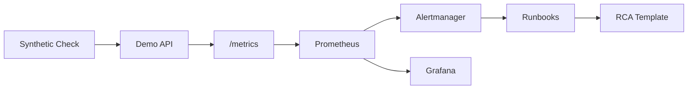

# SRE Observability + Incident Response Lab

[](https://github.com/mrsddq/sre-observability-incident-response-lab/actions/workflows/ci.yml)

Hands-on SRE lab that demonstrates service instrumentation, SLOs, alerting, dashboards, synthetic checks, failure injection, runbooks, RCA templates, and Kubernetes deployment patterns.

## What This Builds

- A small Python HTTP service with `/healthz`, `/readyz`, `/work`, and `/metrics`
- Prometheus scrape config and alert rules
- Grafana dashboard JSON for latency, traffic, errors, and saturation
- SLO definition with error budget policy
- Synthetic HTTP check script
- Kubernetes manifests for app deployment and alerting
- Failure injection playbook
- Incident runbooks, RCA template, and incident timeline template

## Architecture



## Local Demo

Run the service:

```bash
python services/api/app.py
```

Call endpoints:

```bash
curl http://localhost:8000/healthz
curl http://localhost:8000/work
curl http://localhost:8000/metrics
python synthetics/check_http.py --url http://localhost:8000/healthz
```

Optional Docker Compose:

```bash
docker compose up --build
```

## SRE Scenarios

- High latency: call `/work?delay_ms=800`
- Error spike: call `/work?fail=true`
- Readiness failure: set `FORCE_NOT_READY=true`
- Saturation review: compare request rate, latency, and error budget burn

## Portfolio Evidence

See [docs/PORTFOLIO_EVIDENCE.md](docs/PORTFOLIO_EVIDENCE.md) for validation commands, sample signals, and incident-response proof points.

## Production Docs

- [Architecture](docs/architecture.md)
- [Runbook](docs/runbook.md)
- [Incident response](docs/incident-response.md)
- [Cost estimate](docs/cost-estimate.md)
- [Security controls](docs/security-controls.md)

## Make Targets

```bash
make test
make lint
make run
make local-demo
make security-scan
make deploy
make destroy
```

## Interview Story

This project demonstrates practical SRE mechanics: service instrumentation, SLOs, alert rules, dashboards, synthetic checks, failure injection, runbooks, RCA templates, rollback paths and production improvement notes.

## What This Proves

- Understands RED/USE observability signals
- Can define SLOs and alert thresholds
- Can build practical runbooks for incident response
- Can reason about incident timelines, mitigation, and follow-up work
- Can deploy and operate services on Kubernetes
