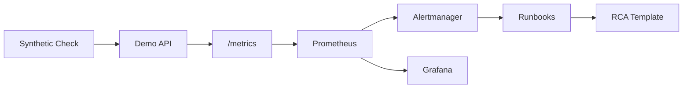

# SRE Observability + Incident Response Lab

[](https://github.com/mrsddq/sre-observability-incident-response-lab/actions/workflows/ci.yml)

Hands-on SRE lab that demonstrates service instrumentation, SLOs, alerting, dashboards, synthetic checks, failure injection, runbooks, RCA templates, and Kubernetes deployment patterns.

## What This Builds

- A small Python HTTP service with `/healthz`, `/readyz`, `/work`, and `/metrics`
- Prometheus scrape config and alert rules
- Grafana dashboard JSON for latency, traffic, errors, and saturation
- SLO definition with error budget policy
- Synthetic HTTP check script
- Kubernetes manifests for app deployment and alerting
- Failure injection playbook
- Incident runbooks, RCA template, and incident timeline template

## Architecture


```mermaid
flowchart LR
    User["Synthetic Check"] --> API["Demo API"]
    API --> Metrics["/metrics"]
    Metrics --> Prometheus["Prometheus"]
    Prometheus --> Alerts["Alertmanager"]
    Prometheus --> Grafana["Grafana"]
    Alerts --> Runbooks["Runbooks"]
    Runbooks --> RCA["RCA Template"]
```

## Local Demo

Requires Python 3.11+; the API and regression suite use only the standard library. Run the service:

```bash
python services/api/app.py
```

Call endpoints:

```bash
curl http://localhost:8000/healthz
curl http://localhost:8000/work
curl http://localhost:8000/metrics
python synthetics/check_http.py --url http://localhost:8000/healthz
```

Optional Docker Compose:

```bash
docker compose up --build
```

## SRE Scenarios

- High latency: call `/work?delay_ms=800`
- Error spike: call `/work?fail=true`
- Readiness failure: set `FORCE_NOT_READY=true`
- Saturation review: compare request rate, latency, and error budget burn

## Portfolio Evidence

See [docs/PORTFOLIO_EVIDENCE.md](docs/PORTFOLIO_EVIDENCE.md) for validation commands, sample signals, and incident-response proof points.

## Production Docs

- [Architecture](docs/architecture.md)
- [Runbook](docs/runbook.md)
- [Incident response](docs/incident-response.md)
- [Cost estimate](docs/cost-estimate.md)
- [Security controls](docs/security-controls.md)

## Make Targets

```bash
make test
make lint
make run
make local-demo
make security-scan
make deploy
make destroy
```

## Interview Story

This project demonstrates practical SRE mechanics: service instrumentation, SLOs, alert rules, dashboards, synthetic checks, failure injection, runbooks, RCA templates, rollback paths and production improvement notes.

## What This Proves

- Understands RED/USE observability signals
- Can define SLOs and alert thresholds
- Can build practical runbooks for incident response
- Can reason about incident timelines, mitigation, and follow-up work
- Provides Kubernetes deployment references for a demo service

## Measurement contract and boundaries

The SLO metrics describe **accepted `/work` requests**. Health checks, readiness checks (including readiness failures), `/metrics` scrapes, unknown paths, and rejected input do not enter the request denominator or latency histogram. This prevents monitoring traffic from diluting the work error rate. A simulated `fail=true` request contributes one work request and one 5xx error. These are process-local counters and reset when the process restarts; Prometheus `rate()` handles counter resets.

The histogram exports cumulative buckets, `_count`, and `_sum`. Observations update under one lock, and each scrape reads one consistent snapshot. Latency measures handler processing time, including injected delay, before response transmission; it is not client-observed network latency.

`delay_ms` defaults to 25 and accepts a single integer in the inclusive range 0–10,000. Malformed, repeated, negative, or excessive values return JSON HTTP 400 without sleeping. This keeps failure injection bounded and avoids a disconnected socket on invalid input.

```bash
# A valid failure contributes to the work error rate.
curl -i 'http://localhost:8000/work?delay_ms=0&fail=true'
# Invalid input returns a structured 400 response.
curl -i 'http://localhost:8000/work?delay_ms=oops'
# Scrapes do not change the counters.
curl 'http://localhost:8000/metrics'
make validate
```

The tests start the actual threaded HTTP server on an ephemeral loopback port. They exercise HTTP success/failure, malformed requests, readiness failure, exclusion of probes from SLOs, concurrent requests, cumulative histogram boundaries, and coherent metric snapshots during concurrent writes. No containers, cluster, or cloud account are needed for these tests.

This is an instrumentation and incident-response **lab**, not a production monitoring deployment. The checked-in alerts are sustained error-rate/p95 thresholds, not an implementation of the multi-window burn-rate policy in `slo/demo-api.yaml`. The Compose stack runs the API, Prometheus, and Grafana; dashboard import and Alertmanager routing require additional setup. Kubernetes manifests require a suitable cluster and, for `PrometheusRule`, the Prometheus Operator CRDs. No deployment is performed by `make validate`.
