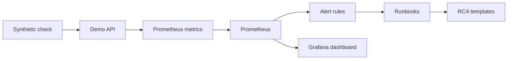
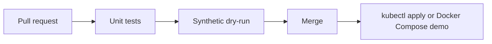
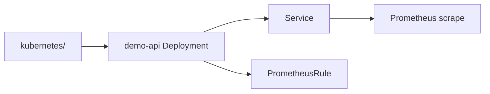
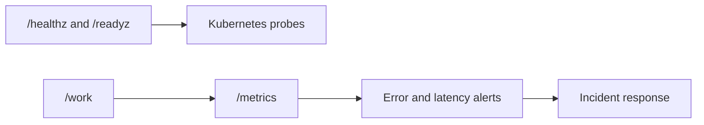

# Architecture

## High-Level Lab

```mermaid
flowchart LR
    Synthetic["Synthetic check"] --> API["Demo API"]
    API --> Metrics["Prometheus metrics"]
    Metrics --> Prometheus["Prometheus"]
    Prometheus --> Alerts["Alert rules"]
    Prometheus --> Grafana["Grafana dashboard"]
    Alerts --> Runbooks["Runbooks"]
    Runbooks --> RCA["RCA templates"]
```

## CI/CD Flow

```mermaid
flowchart LR
    PR["Pull request"] --> Tests["Unit tests"]
    Tests --> SyntheticDryRun["Synthetic dry-run"]
    SyntheticDryRun --> Merge["Merge"]
    Merge --> Deploy["kubectl apply or Docker Compose demo"]
```

## Kubernetes Deployment Flow

```mermaid
flowchart LR
    Manifest["kubernetes/"] --> Deployment["demo-api Deployment"]
    Deployment --> Service["Service"]
    Deployment --> PromRule["PrometheusRule"]
    Service --> Prometheus["Prometheus scrape"]
```

## Observability Flow

```mermaid
flowchart LR
    Health["/healthz and /readyz"] --> Probe["Kubernetes probes"]
    Work["/work"] --> Metrics["/metrics"]
    Metrics --> Alerts["Error and latency alerts"]
    Alerts --> Incident["Incident response"]
```
